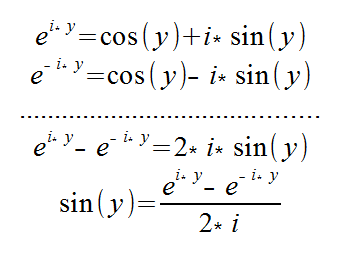
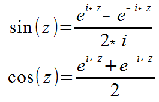

# Complex
Complex is an implementation of a complex number class with complex trigonometry and exponential functions.

The complex trigonometry functions can be defined using Euler's formula as follows:
<br />
Thus:<br />


## Using this library:
If you are using Maven, specify this library in your pom.xml file.
```
  <dependencies>
    <dependency>
    	<groupId>com.github.easai.math</groupId>
    	<artifactId>Complex</artifactId>
    	<version>0.0.1</version>
    </dependency>
  </dependencies>
```
## Complex API
The API documentation is here (<a href="https://cdn.rawgit.com/easai/Complex/0eb79896/doc/index.html">Complex API</a>)

## Application
<a href="https://github.com/easai/Mandelbrot">Mandelbrot.jar</a><br />

